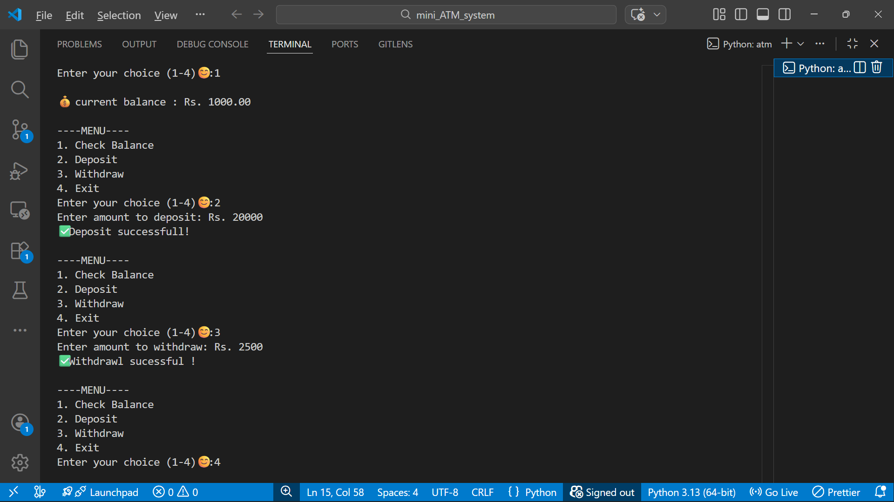

# 🏦 Mini ATM System (Python)

A simple console-based ATM system built using Python.
This project simulates basic ATM functionalities like checking balance, depositing money, withdrawing money, and exiting the system.

---

## 🚀 Features

- ✅ Check Account Balance
- 💰 Deposit Money
- 💸 Withdraw Money
- ❌ Prevent Negative Transactions
- 🔁 Continuous Menu using Loop
- 🛑 Exit Option

---

## ▶ How to Run

1. Clone the repository:
```
git clone https://github.com/radhapaswan0625/mini-atm-system.git
```

2. Navigate into the project folder:
```
cd mini-atm-system
```

3. Run the program:
```
python atm.py
```

---

## 📸 Sample Output


